# Installation of Linux OS using VM

If you want to use linux without making changes to you current windows system, you can use `VM`
(virtual manager) to achieve this goal. There are several software which can be used to run
_guest operating system_. Some of them are:

* Virtual Box
* VMWare
* QEMU

We'll focus on Virtual Box here.

`VirtualBox` is free and open source virualization software from Oracle.

## Requirments

* Good Internet Connection to download ISO(most of them are around size of **2GB**)
* Minimum RAM of around 4GB for windows(should have 8GB) although it'll depends on which distro
	you're trying to install
* Host system with atleast 8 - 10GB of disk space.
* Should enable hyper visualization from your **BIOS(UEFI)** setting

## Steps

Here are the steps to install linux OS on vm

### Download and Install VirtualBox

Go to the website of Oracle VirtualBox and get the latest stable version according to your
host system.

### Download the Linux ISO

Next, you need to download the ISO file of the linux distribution which you want from it's
official website.

There are several types of linux/unix based distros out there, some are:
* Debian based
	- Debian
	- Ubutnu
	- Mint
	- Elementary
* Arch based
	- Arch
	- Manjaro
	- Void
	- Antergos
* NixOS
* Fedora
* RedHat
* OpenSuse
* Gentoo
* BSD
	- FreeBSD
	- OpenBSD etc.

I'm using `Debian` in here as example. Get it from the following link
`https://www.debian.org/`

Whatever distribution you downloaded it's highly recommended to check its checksum(md5, sha256) etc.

### Virtual Machine Creation

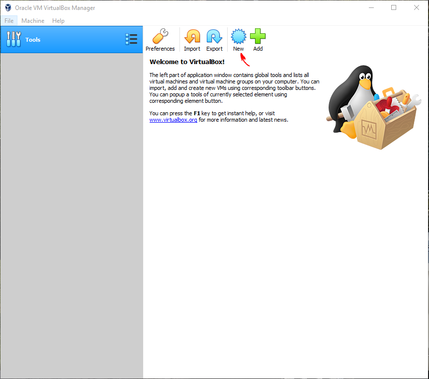

Click **New** button to create VM

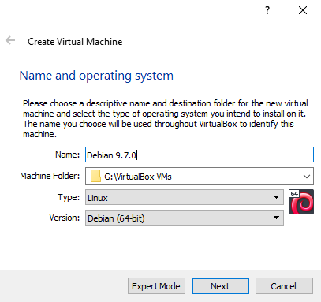

Provide a **name** of your choice to the new VM and a **directory location** to store the related
files. Also give type as **Linux** and type of **distro**.


Give a memory size to your VM. Minimum for debian is around 512GB,
also you shouldn't allocate more than half of RAM size what the host have.

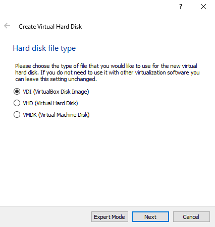

Choose **Create a virtual hard disk now** option and click **Create**.

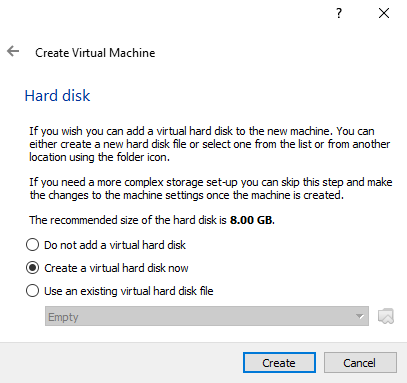

Choose **VDI** option and click **Next.**

Choose **Dynamically Allocated** option and click **Next**.

Provide a **Hard Disk size** for your VM and click **Create**.

### Debian Installation

Provide the downloaded Debian ISO image to the newly created VM.

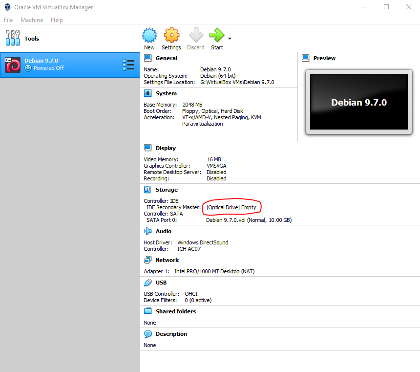

Now, click on **[Optical Drive] Empty**

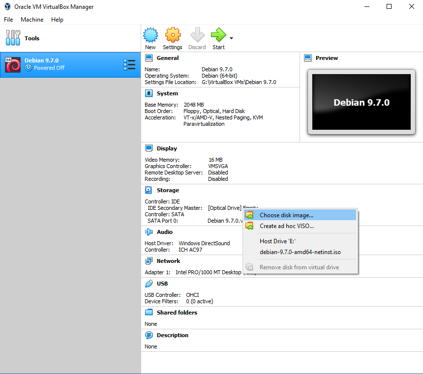

Select **Choose disk image...** and give it you ISO location


Now things will look like this. Click **start** button to start your VM.


This here is `grub menu` from here, you can start to install your linux os on VM.

Refer to this website https://medium.com/platform-engineer/how-to-install-debian-linux-on-virtualbox-with-guest-additions-778afa0ee7e0
for more info.

# Practicing Linux Commands

## Introduction

* All the linux commands are run in terminal(exceptions are there.)
* There are severel types of terminal in linux, like:
	- termite
	- alacritty
	- konsole
	- gnome-terminal
	- xterm
	- urxvt
	- kitty
	- terminator etc.
* Linux commands are _case-sensitive_.
* The terminal can be used to accomplish all administrative tasks. This includes:
	- Package Installation
	- File editing
	- File manipulation
	- User and group management and many other things

## General Commands

I'm going to give some screenshots of general commands (acc. to the syllabus). These
commands are:

* **date** - displays the current system date and time
* **cal** - display calender of a specific month or a whole year
* **clear** - used to clear the terminal
* **who** - displays the information about all currently logged in user on the system
* **whoami** - display the username of current user
* **exit** - exits the shell/terminal
* **history** - displays the previously executed commands
* **bc** - start command line calculator
* **alias** - used to give user defined name to a command or sequence of commands
* **shutdown** - used to shutdown the system
* **reboot** - restart or reboot the system
* **banner** - prints string in large ascii character set

## File Related Commands

* **mkdir** - used to create directory/ies
* **rmdir** - uset to remove blank directory
* **cat** - display content of file, also used to overwrite or append content of file
* **ls** - used to list files and directory/ies
* **rm** - used to remove files from system
* **pwd** - prints current working directory
* **find** - finds different types of files and directories in system
* **gzip** - compresses file/s in _.gz_ format
* **gunzip** - uncompress the _.gz_ format
* **wc** - used to count letters, words and line from file or stdin
* **cd** - used to change directory
* **mv** - used to move files/directories, same as cut in windows

Here, are few screenshots of the above mentioned commands:

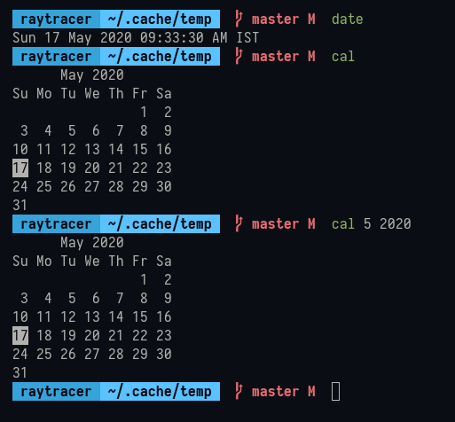

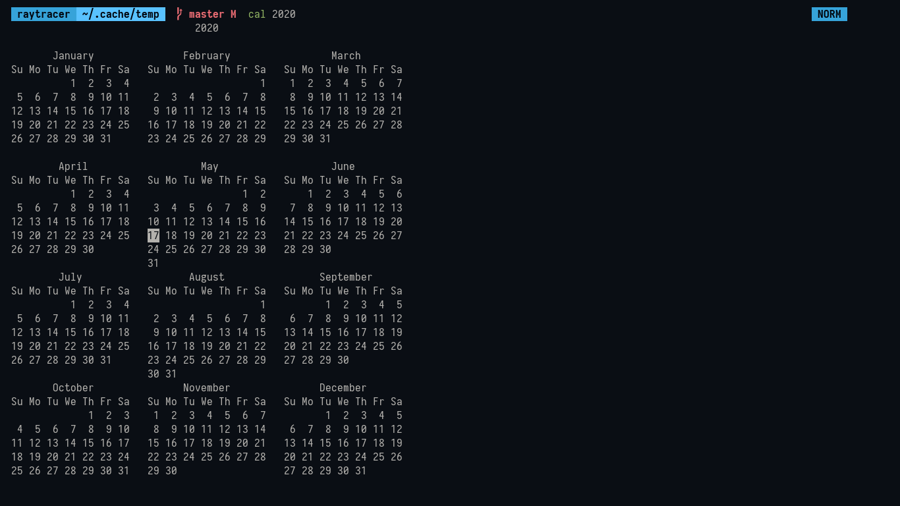

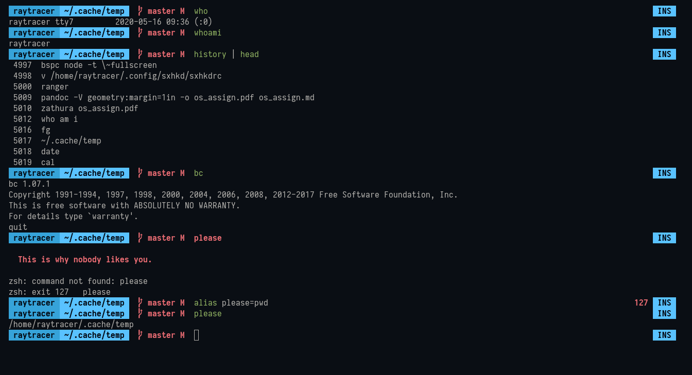

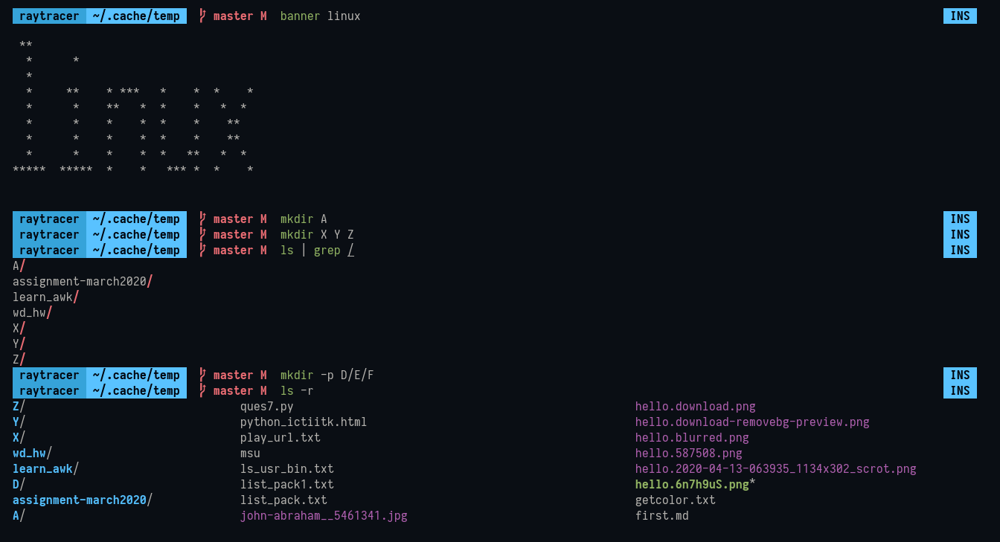

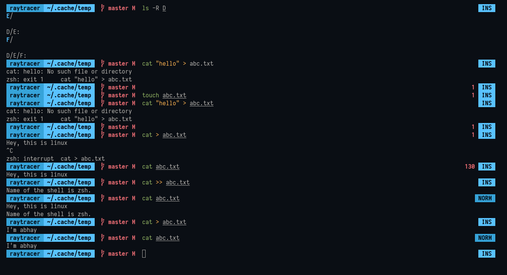

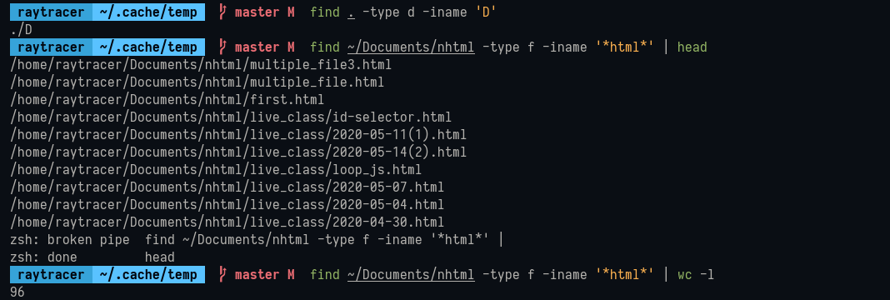

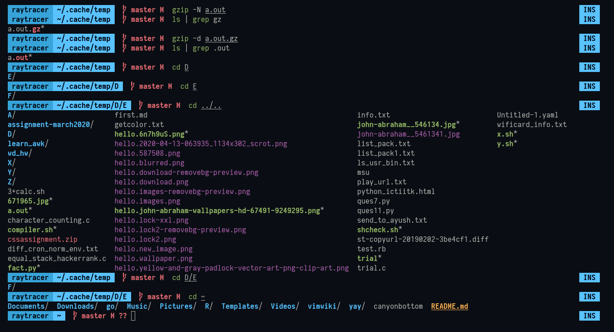

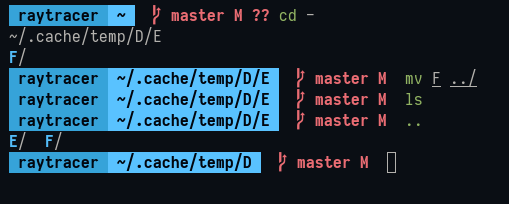

There are several arguments, options and flags in almost every linux command.
To know more you can do:

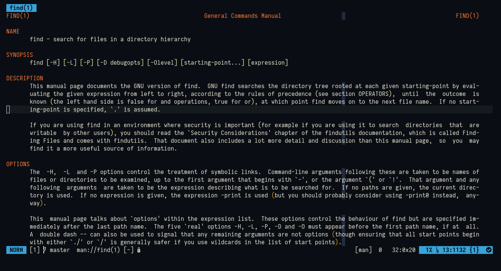

```sh
$ man find  # this will give manual of find command
$ man man  # manual of man command
```

# Implementing Shell Scripting on Linux

## Need of Shell Scripting

Sometimes, we want to execute a bunch of commands routinely, so we have to type in all
commands each time in terminal. As shell can also take commands as input from file we
can write commands in a file and can execute them in shell to avoid this repetitive work.

## Introduction

* Shell scripts are also known as `Shell Programs` or `Shell Procedures.`
* Shell script file means, a file contains a set of commands within it.
	If any file contains commands, then the can be used as executable file
	(after making executable.)
* Shell scripts are similar to the **"batch file"** in windows environment.
* It can be useful to execute the set of commands at a single moment of time, we will
	get our required outputs and those can also be saved under a file.
* Executing commands seperately will consume more time, using shell scripts we can reduce
	this time to greater extent.
* Shell scripts can also take arguments, which are known as command line arguments.

## Steps to execute shell scripts

* Write a shell script in a file in your editor and save it.
* It isn't necessary to save file with **.sh** extension, because in linux every these
	files can be identified as scripts with there shebang.
```
#!/usr/bin/env sh

#!/bin/bash
```
* Add an executable permission to the script file
```sh
$ chmod u+rx file1.sh

$ chmod +x file2.sh

$ chmod 754 file3.sh
```

* Execute the file with in your shell environment
```sh
$ ./file2.sh

$ dash file.sh

$ sh file3.sh
```

## Types of Shell Scripts

1. Static Scripts(Non-Interactive Scripts)
2. Dynamic Scripts(Interactive Shell Scripts)

### Static Scripts

It does not require any input from the user once the execution has started

**Program-1:** Write a static script using the cat command to execute the following commands-
`ls, date, cal, who`
```sh
$ cat > script1.sh
ls
date
cal
who  # press ctrl-d
$
$ chmod u+x script1.sh
$ ./script1.sh
os_assign.html
os_assign.md
os_assignment.aux
os_assignment.fdb_latexmk
os_assignment.fls
os_assignment.lof
os_assignment.log
os_assignment.lot
os_assignment.md
os_assignment.pdf
os_assignment.tex
os_assignment.toc
os_assign.pdf
oslab_images
Sun 17 May 2020 11:16:10 AM IST
      May 2020
Su Mo Tu We Th Fr Sa
                1  2
 3  4  5  6  7  8  9
10 11 12 13 14 15 16
17 18 19 20 21 22 23
24 25 26 27 28 29 30
31
raytracer tty7         2020-05-16 09:36 (:0)
$
```

**Program-2:**: Write a static script using the cat command to execute the following commands-
`ls, date, cal, whoami` along with seperator and appropriate messages

```sh
$ cat > script2.sh
echo "-----------------------------"
ls
echo "-----------------------------"
echo "The date is $(date)"
echo "-----------------------------"
cal
echo "-----------------------------"
printf "%s" "I'm $(whoami)"
echo "-----------------------------"
$
$ chmod 754 script2.sh
$ ./script2.sh
-----------------------------
bullet_style.tex
chap_breaks.tex
listings_setup.tex
os_assign.md
oslab_images
pdf_property.tex
-----------------------------
The date is Sun 17 May 2020 01:33:39 PM IST
-----------------------------
      May 2020
Su Mo Tu We Th Fr Sa
                1  2
 3  4  5  6  7  8  9
10 11 12 13 14 15 16
17 18 19 20 21 22 23
24 25 26 27 28 29 30
31
-----------------------------
raytracer
-----------------------------
```
**Student Task**: Write a static script using cat command to execute the following commands-
`whaomi, cal 2020, banner <Your Name>` with appropriate titles

> whoami done above
```sh
$ cat > student1.sh
echo "Calender of this year"
cal
echo "My name is: "
banner Abhay
figlet -f /usr/share/figlet/fonts/3D\ Diagonal.flf 'Abhay'
$
$ chmod +x student1.sh
$ ./student1.sh
Calender of this year
                               2020

       January               February                 March
Su Mo Tu We Th Fr Sa   Su Mo Tu We Th Fr Sa   Su Mo Tu We Th Fr Sa
          1  2  3  4                      1    1  2  3  4  5  6  7
 5  6  7  8  9 10 11    2  3  4  5  6  7  8    8  9 10 11 12 13 14
12 13 14 15 16 17 18    9 10 11 12 13 14 15   15 16 17 18 19 20 21
19 20 21 22 23 24 25   16 17 18 19 20 21 22   22 23 24 25 26 27 28
26 27 28 29 30 31      23 24 25 26 27 28 29   29 30 31

        April                   May                   June
Su Mo Tu We Th Fr Sa   Su Mo Tu We Th Fr Sa   Su Mo Tu We Th Fr Sa
          1  2  3  4                   1  2       1  2  3  4  5  6
 5  6  7  8  9 10 11    3  4  5  6  7  8  9    7  8  9 10 11 12 13
12 13 14 15 16 17 18   10 11 12 13 14 15 16   14 15 16 17 18 19 20
19 20 21 22 23 24 25   17 18 19 20 21 22 23   21 22 23 24 25 26 27
26 27 28 29 30         24 25 26 27 28 29 30   28 29 30
                       31
        July                  August                September
Su Mo Tu We Th Fr Sa   Su Mo Tu We Th Fr Sa   Su Mo Tu We Th Fr Sa
          1  2  3  4                      1          1  2  3  4  5
 5  6  7  8  9 10 11    2  3  4  5  6  7  8    6  7  8  9 10 11 12
12 13 14 15 16 17 18    9 10 11 12 13 14 15   13 14 15 16 17 18 19
19 20 21 22 23 24 25   16 17 18 19 20 21 22   20 21 22 23 24 25 26
26 27 28 29 30 31      23 24 25 26 27 28 29   27 28 29 30
                       30 31
       October               November               December
Su Mo Tu We Th Fr Sa   Su Mo Tu We Th Fr Sa   Su Mo Tu We Th Fr Sa
             1  2  3    1  2  3  4  5  6  7          1  2  3  4  5
 4  5  6  7  8  9 10    8  9 10 11 12 13 14    6  7  8  9 10 11 12
11 12 13 14 15 16 17   15 16 17 18 19 20 21   13 14 15 16 17 18 19
18 19 20 21 22 23 24   22 23 24 25 26 27 28   20 21 22 23 24 25 26
25 26 27 28 29 30 31   29 30                  27 28 29 30 31
My name is:

  **    *       *
 *  *   *       *
*    *  *       *
*    *  * ***   * ***    ****   *    *
*    *  **   *  **   *       *  *    *
******  *    *  *    *   *****  *    *
*    *  *    *  *    *  *    *  *   **
*    *  **   *  *    *  *   **   *** *
*    *  * ***   *    *   *** *       *
                                *    *
                                 ****


   ,---,                   ,---,
  '  .' \        ,---,   ,--.' |
 /  ;    '.    ,---.'|   |  |  :
:  :       \   |   | :   :  :  :
:  |   /\   \  :   : :   :  |  |,--.  ,--.--.        .--,
|  :  ' ;.   : :     |,-.|  :  '   | /       \     /_ ./|
|  |  ;/  \   \|   : '  ||  |   /' :.--.  .-. | , ' , ' :
'  :  | \  \ ,'|   |  / :'  :  | | | \__\/: . ./___/ \: |
|  |  '  '--'  '   : |: ||  |  ' | : ," .--.; | .  \  ' |
|  :  :        |   | '/ :|  :  :_:,'/  /  ,.  |  \  ;   :
|  | ,'        |   :    ||  | ,'   ;  :   .'   \  \  \  ;
`--''          /    \  / `--''     |  ,     .-./   :  \  \
               `-'----'             `--`---'        \  ' ;
                                                     `--`
```

### Dynamic Script

It requires input from the user once the execution has started

**Program-3:** Write a dynamic script to find list of the files or directories from a given directory

```sh
cat > give_list.sh
# taking path
echo "list of the files/directories are:"
echo
ls "$1"
$
$ chmod +x give_list.sh
$ ./give_list.sh "$HOME"
list of the files/directories are:

canyonbottom
Documents
Downloads
go
Music
Pictures
R
README.md
Templates
Videos
vimwiki
yay
$
```

**Student Task** Write a dynamic script to take month number and year number and display it's cal

```sh
$ cat > show_cal.sh
echo "Enter month and year"
read month
read year
cal "${month}" "${year}"
$
$ chmod u+x show_cal.sh
$ ./show_cal.sh
Enter month and year
12
2004
    December 2004
Su Mo Tu We Th Fr Sa
          1  2  3  4
 5  6  7  8  9 10 11
12 13 14 15 16 17 18
19 20 21 22 23 24 25
26 27 28 29 30 31
$
```

**Program-4:** Write a dynamic script to arithmetic calculations of given values

```sh
$ cat > calculation.sh
echo "Enter two numbers"
read -r fnum
read -r snum
echo "You entered:"
printf "%s\n%s\n" "first num: ${fnum}" "second num: ${snum}"
printf "Addition: %s\n" $(( fnum + snum ))
printf "Substraction: %s\n" $(( fnum - snum ))
printf "Multiplication: %s\n" $(( fnum * snum ))
printf "Division: %s\n" $(( fnum / snum ))
printf "Remainder: %s\n" $(( fnum % snum ))
$
$ chmod 740 calculation.sh
$ ./calculation.sh
Enter two numbers
5
4
You entered:
first num: 5
second num: 4
Addition: 9
Substraction: 1
Multiplication: 20
Division: 1
Remainder: 1
```

**Program-5**: Write a dynamic script to compare whether the two strings are equal or not

```sh
$ cat compare.sh
echo "Enter 2 names"
read fname
read sname
echo "You entered:"
printf "%s\n%s\n" "first name: ${fname}" "second name: ${sname}"
echo "String comparision result is:`expr $fname = $sname`"
$
$ chmod u+x compare.sh
$ ./compare.sh
Enter 2 names
Ram
Shyam
You entered:
first name: Ram
second name: Shyam
String comparision result is:0
```

Here's an example of shell scripting, this script opens man page in vim and also
lets you fuzzy find all _apropos_ commands

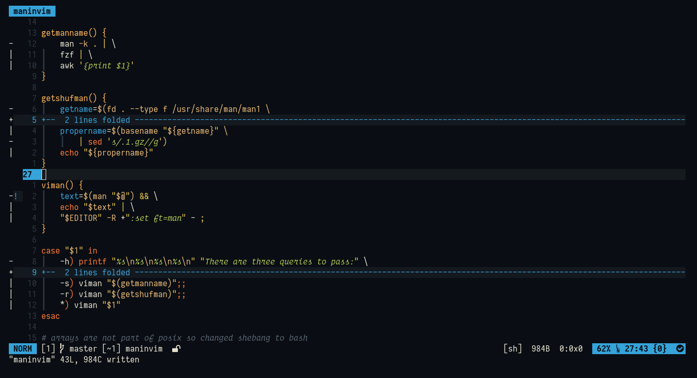

# Implementing Cron Jobs in Linux

## Introduction to Cron Jobs

* `Cron` is one of the most useful utility on Linux Operating System. It is used to
schedule commands at specific time. These scheduled commands or tasks are known
as `Cron Jobs`.
	- There are some other programs also which are used to schedule taks in linux,
	they are:
		- **Anacron**: Scheduler works even when your system is off
		- **Fcron**: Best of both _cron_ and _Anacron_
		- **Hcron**: Lesser known, easy label of jobs, back-up etc.
		- **Jobber**: Written in `go`, it features job execution history with status
		- **entr**: Not same as above, rather it watches changes happened in
			content of files
* Cron is generally used for running scheduled backups, monitoring disk space,
	deleting files (periodically which is no longer required), running system
	maintainance tasks, etc.
* Mostly `cron` comes installed in most distros but if not you can do in following ways:
	- For `arch` based distros, it is available in `pacman`:
		```sh
		$ sudo pacman -S cronie

		# after installation enable and start cron service(daemon)
		$ sudo systemctl enable cronie.service
		$ sudo systemctl start cronie.service

		# to check if it's activated check status
		$ sudo systemctl status cronie.service
		● cronie.service - Periodic Command Scheduler
			 Loaded: loaded (/usr/lib/systemd/system/cronie.service; enabled; vendor preset: disabled)
			 Active: active (running) since Sun 2020-05-17 16:48:21 IST; 7s ago
		   Main PID: 241166 (crond)
			  Tasks: 1 (limit: 4051)
			 Memory: 572.0K
			 CGroup: /system.slice/cronie.service
					 └─241166 /usr/bin/crond -n

		May 17 16:48:21 server systemd[1]: Started Periodic Command Scheduler.
		May 17 16:48:21 server crond[241166]: (CRON) STARTUP (1.5.5)
		May 17 16:48:21 server crond[241166]: (CRON) INFO (Syslog will be used instead of sendmail.)
		May 17 16:48:21 server crond[241166]: (CRON) INFO (RANDOM_DELAY will be scaled with factor 26% if used.)
		May 17 16:48:21 server crond[241166]: (CRON) INFO (running with inotify support)
		May 17 16:48:21 server crond[241166]: (CRON) INFO (@reboot jobs will be run at computer's startup.)
		```
		> systemctl works only systemd based distros.
* There is a cron "daemon" that runs on linux system.
	- **Daemon**: A daemon is a program that runs in the background all the time, usually initiated
		by the system)
* This cron daemon is responsible for launching the cron jobs on schedule
* Cron does contains its own environment variables, which are sometimes different than of your shell.

## Syntax

There are two main parts:
	1. The first part is Timing.
	2. The second part is command that would run from command line.

### Timing Syntax

This is the first part of the cron job string. It determines how often and when the cron jobs is
going to run

It consists of 5 parts:

1. minute
2. hour
3. day of month
4. month
5. day of week

```
	* * * * *
	| | | | |
	| | | | ---> Day of Week(0-6) where 0 represents Sunday
	| | | -----> Month (1-12)
	| | -------> Day of Month (1-31)
	| ---------> Minute (0-23)
	-----------> Minute (0-59)
```

An `asterisk(*)` represents all possible numbers for that position. For example,
asterisk in the minute position would make it run every minute.

**Examples**:


## Managing Cron Jobs
* This cron job will run every minute, all the time
```sh
* * * * * [command]
```
* This cron job will run at minute zero, every hour (i.e., an hourly cron job)
```sh
0 * * * * [command]
```
* This is an hourly cron job but run at minute 15 instead
```sh
15 * * * * [command]
```
* This will run once a day, at 2:30am
```sh
30 2 * * * [command]
```
* Division operator is also used. This will run 12 times per hour, i.e., every 5 minutes
```sh
*/5 * * * * [command]
```
* There are few special keyword that will let you run a cron job

| **Syntax**		 | **Work**				  |
| :----------------: | :--------------------: |
| @reboot[command]	 | Run once, at start-up  |
| @yearly[command]	 | Run once a year		  |
| @yearly[command]	 | Run once a year		  |
| @annually[command] | Same as year			  |
| @monthly[command]	 | Run once a month		  |
| @weekly[command]	 | Run once a weekly	  |
| @daily[command]	 | Run once a daily		  |
| @midnight[command] | Same as daily		  |

1. **crontab -e**: This command is used to edit the contents of the crontab file
2. **crontab -l**: This command is used to see existing cron jobs
3. **crontab -r**: This command is used to delete the existing cron jobs

Here, are the screenshots of the cron jobs which I'm using currently:

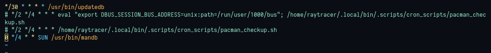

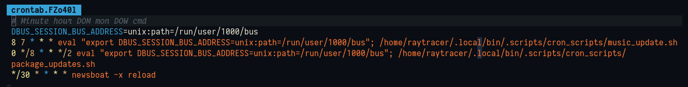

**Thank You**
